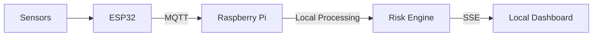

# JEEVONE
### Your Unified Health Monitor


Privacy-preserving, offline-capable health monitoring pipeline designed for edge devices like the Raspberry Pi.

> **Note:** This system operates entirely locally. Internet access is NOT required for core operation. Your health data stays in your control.

---

## Architecture Overview

The system is designed with a lightweight, disconnected edge computing model:



- **ESP32**: Handles sensor data acquisition and publishes it over MQTT.
- **Raspberry Pi**: The core edge-processing platform running this codebase. Features include:
  - MQTT Broker & Subscriber
  - Payload Validation & Normalization
  - SQLite Database Storage
  - Advanced Risk Engines (Heat, Vital, Respiratory)
  - REST API & Real-time Dashboard

---

## Quick Start

### 1. Install Dependencies

```bash
pip install -r requirements.txt
```

### 2. Install and Start Mosquitto Broker

**macOS (Development):**
```bash
brew install mosquitto
/opt/homebrew/opt/mosquitto/sbin/mosquitto -c config/mosquitto.conf -d
```
> *Note:* The `persistence` block in `mosquitto.conf` is ignored on macOS unless `/var/lib/mosquitto/` exists. For local development, persistence is optional.

**Raspberry Pi (Production):**
```bash
sudo apt install mosquitto mosquitto-clients -y
sudo cp config/mosquitto.conf /etc/mosquitto/conf.d/health.conf
sudo systemctl restart mosquitto
```
> *Note:* `apt install mosquitto` automatically creates `/var/lib/mosquitto/`, so persistence works out of the box.

### 3. Start the Processing Pipeline

This will initialize the pipeline, REST API, and real-time dashboard.

```bash
python -m app.main
```

**Access the Dashboard:** Open `http://localhost:8000` in a web browser.

### 4. Run the ESP32 Simulator (Optional)

If you do not have physical hardware connected, you can simulate sensor data:

```bash
# Normal scenario
python scripts/simulate_esp32.py --scenario normal --interval 2

# Heat-stress test
python scripts/simulate_esp32.py --scenario heat_stress --count 30

# List available scenarios
python scripts/simulate_esp32.py --list
```
> *Scenarios available:* `normal` | `heat_stress` | `abnormal_hr` | `low_spo2` | `combined_risk`

---

## API Endpoints

The system exposes a lightweight REST API and a Server-Sent Events (SSE) stream for real-time dashboard updates.

| Method | Path | Description |
| :--- | :--- | :--- |
| `GET` | `/api/health` | Service liveness check |
| `GET` | `/api/status` | Pipeline statistics |
| `GET` | `/api/latest` | Latest sensor reading + current risk state |
| `GET` | `/api/risk` | Detailed risk breakdown |
| `GET` | `/api/history` | Recent sensor readings from local SQLite database |
| `GET` | `/api/alerts` | Recent alert history and active notifications |
| `GET` | `/api/baseline`| Current dynamic personal baseline metrics |
| `GET` | `/stream` | Server-Sent Events (SSE) real-time update stream |

---

## MQTT Integration

### Topics

| Topic | Direction | Description |
| :--- | :--- | :--- |
| `health/sensors` | ESP32 -> Pi | Sensor data JSON payload |

### Expected Payload Structure
```json
{
  "device_id": "patient_01",
  "timestamp": 1727650000,
  "heart_rate": 78,
  "spo2": 98,
  "body_temperature": 37.2,
  "room_temperature": 28.3,
  "humidity": 61.5,
  "blood_pressure": {
    "sys": 122,
    "dia": 81
  }
}
```
> `blood_pressure` is **optional** — the pipeline handles payloads without it gracefully.


---

## Project Structure

A clean, modular directory structure ensuring easy maintenance and scalability:

```text
personal-health-companion/
├── config/
│   ├── config.yaml          # System parameters and thresholds
│   └── mosquitto.conf       # MQTT Broker configuration
├── app/
│   ├── main.py              # Application entry point
│   ├── config_loader.py     # Singleton configuration loader
│   ├── logger.py            # Structured logging setup
│   ├── pipeline_state.py    # Thread-safe state sharing (MQTT ↔ API)
│   ├── mqtt/                # MQTT integration (Client, Topics)
│   ├── ingestion/           # Data validation, normalization & processing
│   ├── storage/             # SQLite database engines, ORM & repositories
│   ├── processing/          # Feature extraction, sliding windows, baselines
│   ├── risk/                # Health risk engines (Heat, Vital, Fusion, etc.)
│   ├── alerts/              # Alert management and debouncing
│   └── api/                 # Flask REST API and WebSocket routes
├── dashboard/
│   ├── templates/           # Dark-mode dashboard UI (HTML)
│   └── static/              # CSS styles and JavaScript assets
├── scripts/
│   └── simulate_esp32.py    # ESP32 data simulator
├── tests/                   # Comprehensive test suites (pytest)
├── requirements.txt         # Python dependencies
└── .env.example             # Environment variables template
```

---

## Configuration

All tunable pipeline parameters reside in [`config/config.yaml`](config/config.yaml), keeping code free of scattered magic constants. Environment variables (set via `.env` or your shell) seamlessly override these YAML values.

Refer to the included `.env.example` file for a list of available overrides.

---

## Testing

The codebase includes an extensive test suite. Run all tests locally using `pytest`. All 54 tests are designed to pass entirely offline, requiring no external MQTT broker connections.

```bash
python -m pytest tests/ -v
```

---

## Data Pipeline Flow

To ensure robustness, data passes through multiple distinct stages:

1. **Ingestion**: MQTT message is received.
2. **Validation**: Schema, types, timestamps, and plausibility checks are performed.
3. **Normalization**: Validated payload is converted into a structured `SensorReading` dataclass.
4. **Storage**: The raw reading is safely persisted in the local SQLite database.
5. **Processing**: Sliding windows and personal baselines (using slow EMA) are updated.
6. **Feature Extraction**: Derived metrics like heat index, vital deviations, and physiological strain are calculated.
7. **Risk Assessment**: Independent evaluation is conducted by Heat, Vital, and Respiratory engines.
8. **Fusion**: Sub-engines are combined to determine overall risk status and generate contextual recommendations.
9. **Alerts**: State-change detection triggers, applying cooldown debouncing to prevent notification fatigue.
10. **Delivery**: Real-time SSE notification is pushed instantly to the local web dashboard.

---

## Offline Operation & Privacy

This system is built with strict **privacy by design**. The entire stack operates locally on your edge device without requiring outbound internet access:

- Mosquitto MQTT Broker
- Python Processing Pipeline
- SQLite Database
- Flask API
- Web Dashboard

> *Tip:* The only external dependency at startup is the Google Fonts CDN link in the dashboard HTML. To make the dashboard fully air-gapped, simply download the fonts and serve them locally.

---

## Important Disclaimers

- **Sensor error ≠ health event.** Malformed or physically impossible readings are immediately rejected during the validation phase. A bad packet will never falsely trigger a health alert.
- **Not a medical device.** All risk outputs are strictly intended as wellness monitoring indicators. The language used in auto-generated recommendations is intentionally conservative.
- **Adaptive Baselines:** Personal baselines update slowly over time (using Exponential Moving Average, α=0.05) and automatically reject extreme outliers. Temporary anomalous readings will not persistently corrupt the individual's long-term baseline.
